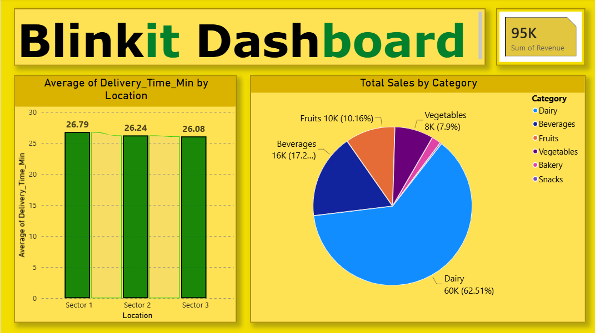

# 08_Blinkit_Dashboard

Welcome to the **Blinkit Dashboard** project! This repository contains the raw data, processing scripts, and Power BI visualization files necessary to analyze and track grocery delivery performance.

## 📁 Project Structure

- `blinkit_data.csv`: The raw dataset containing order details (Order ID, Date, Customer, Item, Category, Price, Delivery Time, Rating, and Location).
- `data_cleaning.py`: A Python script used to clean the raw data, fix formatting, and generate the `Revenue` metrics.
- `blinkit_dashboard.pbix`: The Power BI report file used to visualize key performance indicators.

## 🚀 Prerequisites

To run the cleaning script and view the dashboard, you will need:

- **Python 3.x** installed.
- **pandas** library (`pip install pandas`).
- **Power BI Desktop** installed to view or edit the dashboard.

## 🛠️ Setup & Execution

### 1. Data Cleaning
Navigate to the project folder in your terminal and run the Python script to prepare the dataset:

```bash
python data_cleaning.py
```

This command will automatically generate `blinkit_data_cleaned.csv` in the same directory.

### 2. Visualization
Open the `blinkit_dashboard.pbix` file using **Power BI Desktop**. If the dashboard does not automatically detect the source, import the `blinkit_data_cleaned.csv` file generated in the previous step.



## 📊 Dashboard Highlights

The dashboard focuses on three critical business KPIs:

1. **Total Revenue**: A Card visual that aggregates the `Revenue` column (calculated as `Price` * `Quantity`).
2. **Average Delivery Time by Location**: A Bar Chart visualizing delivery efficiency across different sectors.
3. **Category Performance**: A Pie Chart illustrating the distribution of total sales volume across different product categories.

## Author
**Animesh Sanghi** | *Google Certified Data Analyst*  
[LinkedIn](https://www.linkedin.com/in/animeshsanghi-da/) | [GitHub](https://github.com/animeshsanghi-da)  
Email: animeshsanghi.da@gmail.com

## License

This project is open-source and free to use.