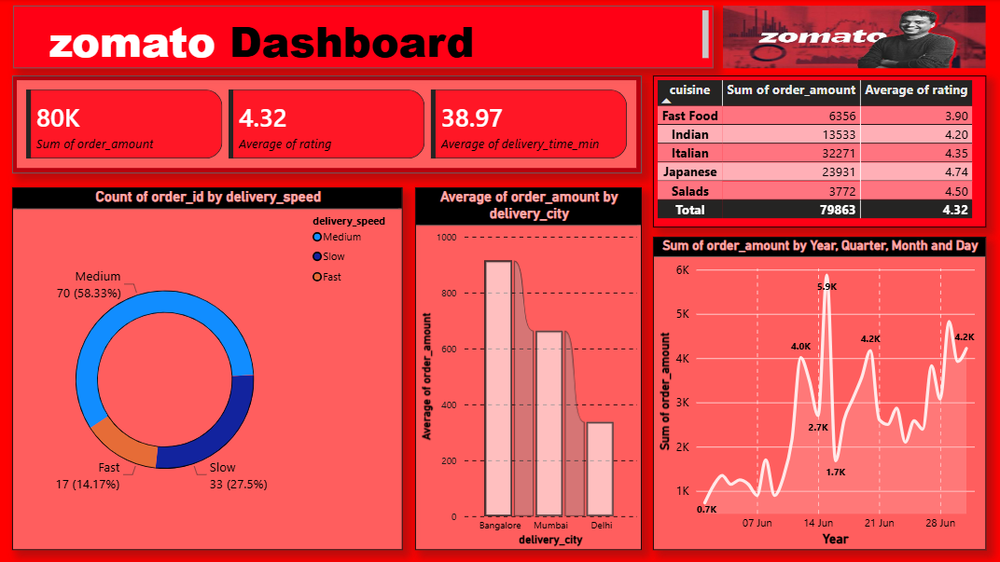

# Zomato Analytics Dashboard

This project focuses on analyzing Zomato delivery data to extract business insights regarding restaurant revenue, customer ratings, and delivery efficiency.

## 🚀 Project Overview
This repository contains the end-to-end process of cleaning raw order data and visualizing it in a professional Power BI dashboard.

## 📊 Key Business Insights
Analysis reveals that while **Sushi House** has the highest order amounts, their delivery time consistently exceeds 45 minutes, marking them as 'Slow' efficiency. Conversely, **Burger King** maintains 'Fast' delivery speeds, keeping customer acquisition high despite lower order values. This suggests a potential trade-off between ticket size and service velocity that stakeholders can leverage.

## 🛠 Tech Stack
* **Data Processing:** Python, Pandas
* **Visualization:** Power BI Desktop

## 📂 Project Structure
* `zomato_data.csv`: The raw dataset.
* `data_cleaning.py`: Python script to clean and feature-engineer the data (adds 'delivery_speed').
* `cleaned_zomato_data.csv`: The processed output ready for analysis.
* `zomato_dashboard.pbix`: The Power BI visualization file.

## ⚙️ Getting Started

### 1. Data Cleaning
Run the provided Python script to prepare the dataset:

```
python data_cleaning.py
```

### 2. Visualize
1. Open `zomato_dashboard.pbix` in Power BI Desktop.
2. Ensure the data source in Power BI is mapped to your `cleaned_zomato_data.csv` file.
3. Refresh the data and explore the Revenue Trends, City Performance, and Delivery Efficiency visuals.



## 📝 Data Dictionary

| Column | Description |
| :--- | :--- |
| `order_id` | Unique ID for each order. |
| `restaurant_name` | Name of the restaurant. |
| `cuisine` | Type of cuisine served. |
| `order_date` | Date of the transaction. |
| `order_amount` | Revenue generated (in INR). |
| `delivery_time_min` | Duration of delivery in minutes. |
| `delivery_speed` | Categorized speed (Fast/Medium/Slow). |
| `rating` | Customer rating out of 5.0. |
| `delivery_city` | City where the order was delivered. |

## Author
**Animesh Sanghi** | *Google Certified Data Analyst*  
[LinkedIn](https://www.linkedin.com/in/animeshsanghi-da/) | [GitHub](https://github.com/animeshsanghi-da)  
Email: animeshsanghi.da@gmail.com

## License

This project is open-source and free to use.