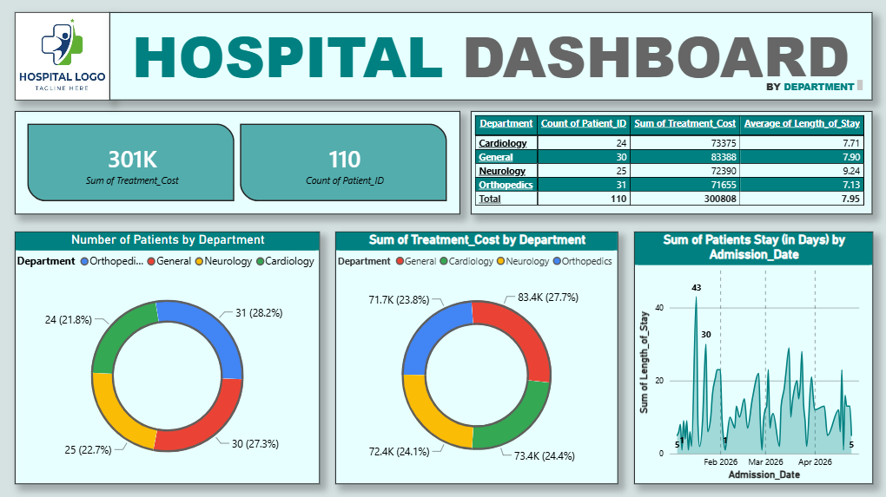
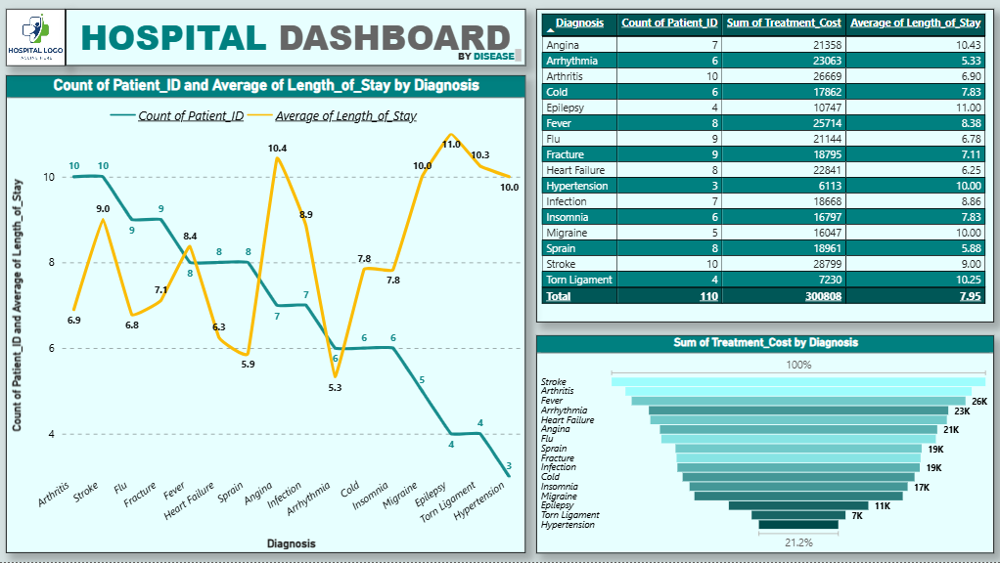

# Hospital Patient Dashboard

This project provides a comprehensive end-to-end data analysis workflow, from raw data cleaning to interactive visualization. It tracks hospital performance metrics such as patient wait times, treatment costs, and department efficiency to support better operational decision-making.

## 📊 Project Overview
The dashboard allows hospital administrators to visualize key performance indicators (KPIs) and identify trends in patient care delivery. By leveraging Python for ETL (Extract, Transform, Load) processes and Power BI for visualization, we transform raw patient records into actionable insights.

## 🛠️ Tech Stack
* **Data Processing:** Python (Pandas, NumPy)
* **Visualization:** Power BI Desktop
* **Data Format:** CSV

## 📂 File Structure
* `patient_data.csv`: The raw dataset containing patient demographics, department details, admission dates, wait times, and treatment costs.
* `data_cleaning.py`: An ETL script that standardizes dates, calculates key metrics like "Length of Stay," and handles missing values.
* `hospital_dashboard.pbix`: The final Power BI report file containing KPIs, trends, and interactive slicers.

## 🚀 Getting Started

### 1. Data Cleaning
Before importing into Power BI, ensure the data is cleaned. Run the Python script:

```
python data_cleaning.py
```

This script will generate `cleaned_patient_data.csv`, which is optimized for Power BI.

### 2. Visualize
1. Open `hospital_dashboard.pbix` in Power BI Desktop.
2. Ensure the data source in Power BI is mapped to your `cleaned_patient_data.csv` file.
3. Refresh the data and explore the visuals.





## 📈 Key Visuals Included
* **KPI Cards:** Total Revenue and Total Patient count.
* **Department Efficiency:** Clustered Bar Chart for Average Wait Time.
* **Length of Stay Analysis:** Area Chart displaying trends over time.
* **Patient Demographics:** Donut Chart showing department distribution.

## Author
**Animesh Sanghi** | *Google Certified Data Analyst*  
[LinkedIn](https://www.linkedin.com/in/animeshsanghi-da/) | [GitHub](https://github.com/animeshsanghi-da)  
Email: animeshsanghi.da@gmail.com

## License

This project is open-source and free to use.